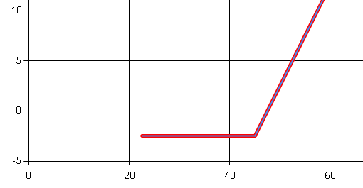

- title : Introduction to options
- description : Introduction to options
- author : Jan Fajfr
- theme : night
- transition : default

***

## Introduction to options

---

### Call and Put Options

- Call is the right to **buy** the stock for agreed price
- Put is the right to **sell** the stock for agreed price
- Option parameters:
	- Underlying (stock or commodity)
	- Strike
	- Expiry
	- Type (Put/Call)
	- Style (American/European)
	- Premium (the price)

---

### Why options
- Hedging
- Investing (speculation :))
- One can get big leverage
- https://www.bloomberg.com/quote/SX5E:IND
- http://www.eurexchange.com/exchange-en/products/idx/stx/blc/19068!quotesSingleViewOption?callPut=Call&maturityDate=201703

---

### Payoff chart
- How much we earn when the stock moves up or down
- Example: Call with strike 45, Premium: 2.5

---

### Strategies

- Traders can buy or sell multiple options in the same time
- Multiple options bought at the same time make up strategies
- Example: Call Spread
	- Buying a call
	- Selling a call with higher strike

---

---

### Covered Call

- Strategy built of a cash leg and an option leg
- I bought the stock at 100 and I want to sell at 120
- Let's profit a bit and sell a call option with strike 120

---

### Payoff of Covered Call

---
