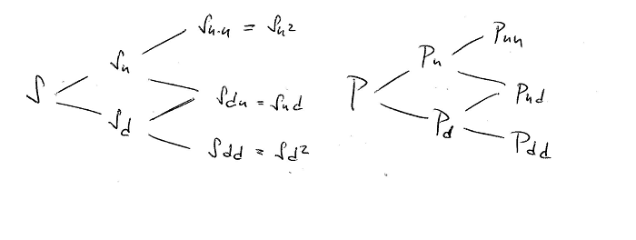
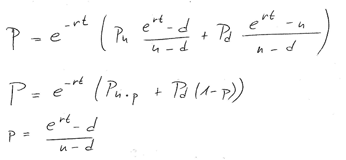
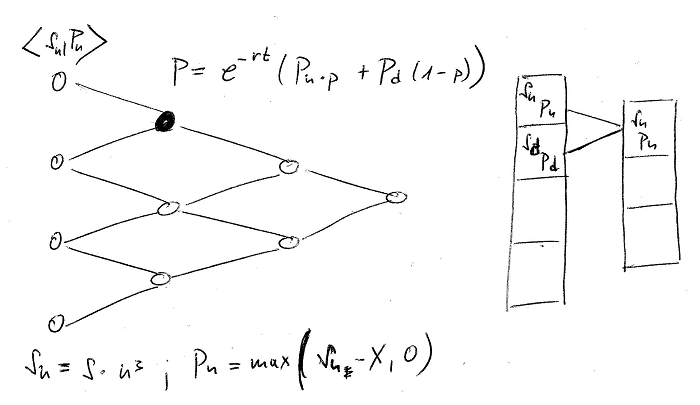
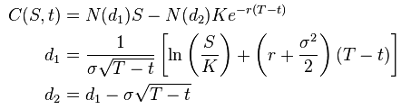

- title : Options pricing
- description : Pricing options in FSharp
- author : Jan Fajfr
- theme : night
- transition : default

***

## Options pricing

---

### What affects option price

- Call option (right to buy)
- Current stock price: 100
- Strike: 110
- Expires tomorrow
- What's the probability that the stock will reach 110 tomorrow?
- If 100%, then what is the faire price?

---

### What about the interest rate?

- Call option (right to buy), with strike 110
- Current underlying price: 100
- Expiries in 6 months
- The current interest rate is 10%
- How does the interest rate affect the option?

---

### Parameters

- All options parameters: strike, expiry, type, style
- Current underlying price
- Volatility of the underlying

---

### Pricing methods

- Black Scholes formula
- Tree based models - binomial or trinomial trees
- Monte Carlo methods
- Finite difference methods

---

### Binomial Pricing

- Construct a tree of possible stock prices
- The tree will go from now to the expiry
- We need a way to predict how the stock price moves

***

### About stock prices

---

### How do the stocks move in real life

- Stock price follows a long term direction
- In the stock oscillates randomly in the short term
- Stock oscillates randomly in the short term
- This can be described using Wiener process

---

### Stock's behavior in binomial tree

- Still a stochastic model but much simpler
- Assume that any time the stock may go up or down
- Split the time between now and the expiry into discrete steps
- In each discrete step we will go up or down

---

### Stock prices tree

- Assume constants **u** and **d**
- Stock in the next step will have either value **S\*u** or **S\*d**
- To simplify, we can say that **d = 1/u**

TODO add the tree here

---

### Stock movement in the real world

- Cox, Ross & Rubinstein pricing model
- We can use the Volatility to obtain **u** and **d**

TODO add the CRR equations

---

### Option price from stock price

- We know how to model the stock, but what about the option?
- At the expiry the price of the option is simple
- Before the expiry however it's not that clear

	match option.Kind with
		| Call -> max 0.0 (stockPrice - option.Strike)
		| Put -> max 0.0 (option.Strike - stockPrice)

---

### Option prices tree

- We could maintain two trees
- The last **Pu** and **Pd** can be calculated
- We need a way to determine **P** from **Pu** and **Pd**

---

### Modelling the tree

		type BinomialNode = {
		    Stock: double
		    Option: double
		    UpParent: BinomialNode option
		    DownParent: BinomialNode option
		}

- We know how to model the tree
- We still don't know how to walk it

---

### Delta Hedging

- Portfolio immune to stock moves
- Long shares of stock = buy stock
- Short delta number options = selling options
- Such Portfolio earns the interest rate

---

### Delta neutral portfolio

---

### One step in the option tree

---

### Merging the nodes

	let mergeNodes downNode upNode context =
	    let optionValue = (context.PUp * upNode.Option +
				context.PDown * downNode.Option)
				*(1.0/context.Rate)

	    let stockValue = upNode.Stock * context.Down
	    {
	        Stock = stockValue
	        Option = optionValue
	        UpParent = Some upNode
	        DownParent = Some downNode
	    }

---

### Implementation overview

- Build the end nodes of both trees
- Walk both trees backwards
- Calculate the option price from the option prices in previous steps

---

### Generating the stock end-nodes prices

- We have to start all the way at the expiry, how do we get there?
- We know that the stock moves up or down with the same probability and we know the depth of the tree

	let generateEndNodePrices (ref:float) (up:float) (periods:int) =
    let down = 1.0 / up
    let lowestStock = ref*(down**(float periods))
    let values = Seq.unfold (fun stock -> stock*up*up) lowestStock
		values |> Seq.take periods
---

### Determine the option price in end node

- Remember that neat function to get option value at any time assuming we know the stock value?

	let optionValue option ref =
        match option.Kind with
                | Call -> max 0.0 (ref - option.Strike)
                | Put -> max 0.0 (option.Strike - ref)

---
### Single step in derivative tree

- Single step is a simple function which takes the array from the previous step
- F\# saves us with *pairwise*

	let step (optionPrices:float list) (pricing:BinomialPricing) =
		optionPrices |> Seq.pairwise
                 |> Seq.map (fun (down,up)-> (pricing.PUp*up+pricing.PDown*down)\*(1.0/pricing.Rate))
                 |> List.ofSeq
---
### Reducing the tree to current node
- We will call this function recursively
- The arrays is getting smaller until it will have only one element in the root of the tree

	let rec reducePrices (stockPrice:float list) (pricing:BinomialPricing) =
	    match stockPrice with
	            | [single] -> single
	            | prices -> reducePrices (step prices pricing) pricing

---

### American options pricing

- For American options we will compare the real option value to the value we get from the derivative tree
- The real option value is the value of the option if the option would be excercised

	let step pricing optionVal (prices:(float*float) list) =
        prices
            |> Seq.pairwise
            |> Seq.map (fun ((sDown,dDown),(sUp,dUp)) ->
                let option = (pricing.PUp*dUp+pricing.PDown*dDown)\*(1.0/pricing.Rate)
                let stock' = sUp*pricing.Down
                let der' = match pricing.Option.Style with
                                    | American -> max option (optionVal stock')
                                    | European -> derValue
                stock',der')
            |> List.ofSeq
---

***

### Black & Scholes in F\#

- No presentation about Options Pricing without BS
- It is just a mathematical formula written in F\#

---

	let d1 =
        ( log(stock.CurrentPrice / option.Strike) +
            (stock.Rate + 0.5 * pown stock.Volatility 2) * option.TimeToExpiry ) /
        ( stock.Volatility * sqrt option.TimeToExpiry )
    let d2 = d1 - stock.Volatility * sqrt option.TimeToExpiry
    let N1 = normal.CumulativeDistribution d1
    let N2 = normal.CumulativeDistribution d2

    let discountedStrike = option.Strike * exp (-stock.Rate * option.TimeToExpiry)
    let call = stock.CurrentPrice * N1 - discountedStrike * N2
    match option.Kind with
        | Call -> call, N1
        | Put -> call + discountedStrike - stock.CurrentPrice, N1 - 1.0

### Summary

- Immutability is useful
- Performance might be an issue
