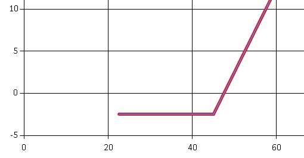
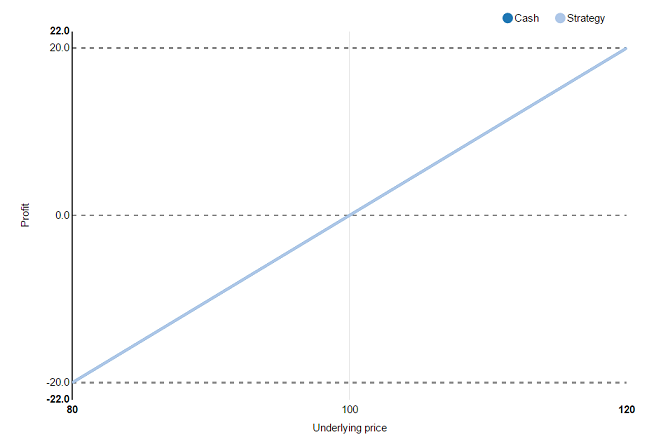
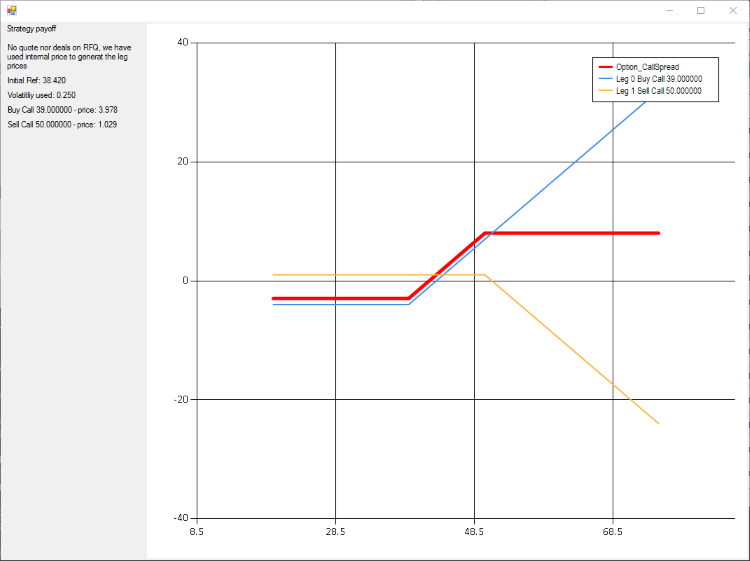
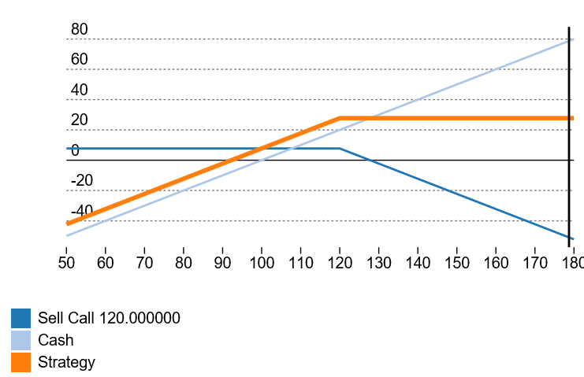
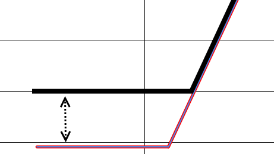
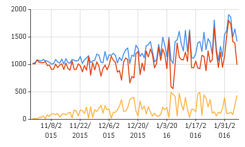
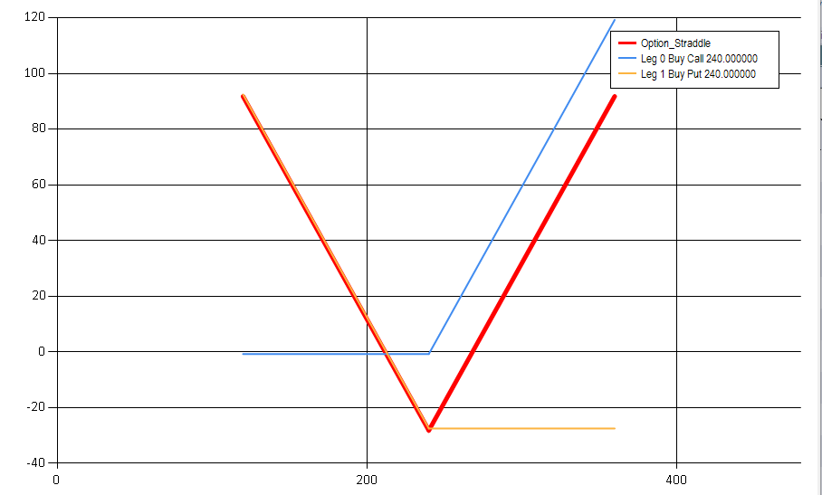

- title : Options pricing
- description : Pricing options in FSharp
- author : Jan Fajfr
- theme : night
- transition : default

***

## Options pricing and Payoff charts

---

### Why is this useful to RFQ-hub

- Fat finger detection
- Payoff charts generation
- Demo mode - reasonable price generation for our sales

---

### Call and Put Options

- Call is the right to **buy** the stock for agreed price
- Put is the right to **sell** the stock for agreed price
- Option parameters:
	- Underlying (stock or commodity)
	- Strike
	- Expiry
	- Type (Put/Call)
	- Style (American/European)
	- Premium (the price)

---

### Why options
- Hedging
- Investing (speculation :))
- One can get big leverage
- https://www.bloomberg.com/quote/SX5E:IND
- http://www.eurexchange.com/exchange-en/products/idx/stx/blc/19068!quotesSingleViewOption?callPut=Call&maturityDate=201703

---

### Payoff chart
- How much we earn when the stock moves up or down
- Example: Call with strike 45, Premium: 2.5

---

### Payoff chart of a stock
- Buying a stock means direct exposition to it's price move

---

### Strategies
- Traders can buy or sell multiple options in the same time
- Multiple options bought at the same time make up strategies
- Example: Call Spread
	- Buying a call
	- Selling a call with higher strike

---

---

### Covered Call

- Strategy built of a cash leg and an option leg
- I bought the stock at 100 and I want to sell at 120
- Let's profit a bit and sell a call option with strike 120

---

### Payoff of Covered Call

---

***

---
### Domain model for options and pricing

---

	type OptionKind =
	    | Call
	    | Put

	type OptionStyle =
	    | American
	    | European

	type OptionLeg = {
	        Direction : float
	        Strike : float
	        Expiry : DateTime
	        Kind : OptionKind
	        Style: OptionStyle
	        PurchaseDate: DateTime
	    }
	    member this.TimeToExpiry = this.Expiry - this.PurchaseDate

	type CashLeg = {
	    Direction: float
	    Price:float
	}
---

### Define the Leg

	type LegInfo =
	    | Cash of CashLeg
	    | Option of OptionLeg

	type Pricing = {
	    Premium: float
	}

	type Leg = {
	    Definition:LegInfo
	    Pricing:Pricing option
	}

---
### Strategy - composition of Legs

	type StockInfo = {
	    Rate:float
	    Volatility: float
	    CurrentPrice: float
	}

	type Strategy = {
	    Stock : StockInfo
	    Name : String
	    Legs: Leg list
	}

---

### Strategy example, defining the legs

	let buyingCash = {
		Definition = Cash {
			Price = 100.0
			Direction = 1.0
		}
		Pricing = None
	}

	let sellingCall = {
        Definition = Option {
            Direction = -1.0
            Strike = 120.0
            Expiry = new DateTime(2017,1,1)
            Kind = Call
            Style = European
            PurchaseDate = DateTime.Now
        }
        Pricing = None
    }

---
### Covered Call again - defined in F\#

	let coveredCall = {
	    Name = "Covered Call"
	    Legs = [
	            buyingCash
	            sellingCall
	        ]
	    Stock =
	        {
	            CurrentPrice = 100.0
	            Volatility = 0.20
	            Rate = 0.01
	        }
	}

***

### Payoff charts generation

- Let's forget the pricing of options
- How can we generate the payoff chart of any strategy?
- Chart is a composition of lines connecting X,Y coordinates

---

### What is the current value of an option

How much I can earn if I exercise the option now?

	match option.Kind with
		| Call -> max 0.0 (stockPrice - option.Strike)
		| Put -> max 0.0 (option.Strike - stockPrice)

---
### What is the payoff of an option

We have to take into account the price of the option

	let legPayoff leg premium stockPrice =
		match leg with
			| Cash cashLeg -> stockPrice - cashLeg.Price
			| Option optionLeg -> optionValue optionLeg stockPrice - premium

---
### Sampling the data
- In order to chart the data, we will need to generate X,Y pairs
- What are the interesting points on X axis?

	let strikes = strategy.Legs |> List.map (fun leg ->
		match leg.Definition with
			| Cash cashLeg -> cashLeg.Price
			| Option optionLeg -> optionLeg.Strike
	)
	let min = 0.5*(strikes |> Seq.min)
	let max = 1.5*(strikes |> Seq.max)
	seq {
		yield min
		yield! strikes
		yield max
	}

---
### Getting the payoff line per leg
For each leg in strategy give me a function to get its payoff

	strategy.Legs |> Seq.map (fun leg ->
	  let legPricing =
			  match leg.Pricing with
	              | Some pricing -> pricing
	              | None -> getLegPricing strategy.Stock leg

	    let pricedLeg = { leg with Pricing = Some legPricing }
	    legPayoff pricedLeg.Definition legPricing
	)

---

### Getting the payoff of the strategy
Taking the pay-off calculators from previous step

	payOffs |> Seq.map (fun payoff ->
		[for stockPrice in interestingPoints -> stockPrice, payOff stockPrice]
	)

The total payoff of our portfolio is just the sum

	let strategyLine = [for stockPrice in interestingPoints do yield stockPrice,
		payOffs |> Seq.sumBy (fun payOff -> payOff stockPrice)
	]

---

### FSharp.Charting
- Part of [FsLab](http://fslab.org/FSharp.Charting/)
- F\# wrapper for windows forms charting
- To draw a line, we just need a list of tuples

	 Chart.Combine(
	    [ Chart.Line(expectedIncome,Name="Income")
	      Chart.Line(expectedExpenses,Name="Expenses")
	      Chart.Line(computedProfit,Name="Profit") ])

---

---

### Apply charting on the strategy data
	 let strategyData,legsData = Options.getStrategyData strategy
	 let strategyLine = Chart.Line(strategyData,Name = strategy.Name)
	                 |> Chart.WithSeries.Style(Color = Color.Red, BorderWidth = 5)

	 let legsLines = legsData |> Seq.mapi (
		 fun i legData -> Chart.Line(legData, sprintf "Leg %i" i)
	 )

	 let allLines = legsLines |> Seq.append [strategyLine]

	 let chart = Chart.Combine allLines |> Chart.WithLegend(true)
---
### Buying the volatility with Straddle

---
***

### Summary of the first part

- There is no magic here!
- Very concise domain model
- F\# makes it very easy to compose functions
- Extendability - imagine adding a new leg type
- This is all about data transformation

***

***

### Charting with Fable

- Fable transpiles F# code to JavaScript

---
### NVD3 charting

	let chart =
		nv.models
			.lineChart()
			.useInteractiveGuideline(true)
			.margin(margin)
			.showLegend(true)
			.showXAxis(true)
			.showYAxis(true)
			.forceY(range);

	el.datum(data).call(chart);

[LineChart](http://nvd3.org/examples/line.html)
---

---
### NVD3 interface in F#
Just create a F# interface and the compiler will call its properties or methods by name

	type Chart() =
		abstract xAxis: Axis
		abstract yAxis: Axis
		abstract forceY: float array -> Chart
		abstract showLegend: bool -> Chart

	[<AbstractClass>]
	type LineChart() = inherit Chart()
  		with member x.useInteractiveGuideline (value:bool): Chart =
				failwith "JSOnly"

---
### NVD3 types

	type Value = {
		x: int
		y: float
	}

	type Series<'a> = {
		key: string
		values: 'a array
	}

---

### Converting data into NVD3 types

	let strategy = {
		key = "Strategy"
		values = data.StrategySerie |> Charting.tuplesToPoints
	}

	let legs =
		data.LegsSeries |> Seq.map (fun (leg,linedata) ->
		{
			key = leg.Definition.Name
			values = linedata |> Charting.tuplesToPoints
		})

	seq {
		yield! legs
		yield strategy
	}

***

### Options pricing

- The easiest way is to use Black - Scholes formula
- American options can't be priced with the BS formula
- Binomial pricing models to the rescue
	- Can be used to price American options
	- Once the framework is built, it can price other derivatives

---

### Black & Scholes in F\#

- No presentation about Options Pricing without BS
- It is just a mathematical formula written in F\#

---

	let d1 =
        ( log(stock.CurrentPrice / option.Strike) +
            (stock.Rate + 0.5 * pown stock.Volatility 2) * option.TimeToExpiry ) /
        ( stock.Volatility * sqrt option.TimeToExpiry )
    let d2 = d1 - stock.Volatility * sqrt option.TimeToExpiry
    let N1 = normal.CumulativeDistribution d1
    let N2 = normal.CumulativeDistribution d2

    let discountedStrike = option.Strike * exp (-stock.Rate * option.TimeToExpiry)
    let call = stock.CurrentPrice * N1 - discountedStrike * N2
    match option.Kind with
        | Call -> call, N1
        | Put -> call + discountedStrike - stock.CurrentPrice, N1 - 1.0

---
### Binomial Pricing

- We assume that at any time the stock may go up or down with given probability
- We take the computer power to construct the tree of all the possible values that the stock can have
- In the same time maintain a tree of the option values
- At each node the tree will tell us what the option would be worth
- We separate the time between now and the expiry of the option into multiple discrete steps
- The size of the tree depends on how much time we have

---

### How exactly does the stock behave

- Assume that there are constants **u** and **d** which symbolize the movements of the stock
- The stock in the next time step will have value **S\*u** if it goes up or **S\*d** if it goes down.

---

### Calculating the price of the option

- What is the price of the option if we know the price in the next two nodes?
- We need what the option is worth if it moves down and up, can we determine the price now?
- This was determined by Cox, Ross, & Rubinstein in the [CRR binomial pricing model](https://en.wikipedia.org/wiki/Binomial_options_pricing_model)

---
### Implementation overview

- First we build the end nodes of the tree (values at expiry)
- Then we will walk the tree back to the root
- At each node we have the tuple giving us the stock price and the option price

---

### Generating the stock end-nodes prices

- We have to start all the way at the expiry, how do we get there?
- We know that the stock moves up or down with the same probability and we know the depth of the tree

	let generateEndNodePrices (ref:float) (up:float) (periods:int) =
    let down = 1.0 / up
    let lowestStock = ref*(down**(float periods))
    let values = Seq.unfold (fun stock -> stock*up*up) lowestStock
		values |> Seq.take periods
---

### Determine the option price in end node

- Remember that neat function to get option value at any time assuming we know the stock value?

	let optionValue option ref =
        match option.Kind with
                | Call -> max 0.0 (ref - option.Strike)
                | Put -> max 0.0 (option.Strike - ref)

---
### Single step in derivative tree

- Single step is a simple function which takes the array from the previous step
- F\# saves us with *pairwise*

	let step (optionPrices:float list) (pricing:BinomialPricing) =
		optionPrices |> Seq.pairwise
                 |> Seq.map (fun (down,up)-> (pricing.PUp*up+pricing.PDown*down)\*(1.0/pricing.Rate))
                 |> List.ofSeq
---
### Reducing the tree to current node
- We will call this function recursively
- The arrays is getting smaller until it will have only one element in the root of the tree

	let rec reducePrices (stockPrice:float list) (pricing:BinomialPricing) =
	    match stockPrice with
	            | [single] -> single
	            | prices -> reducePrices (step prices pricing) pricing

---

### American options pricing

- For American options we will compare the real option value to the value we get from the derivative tree
- The real option value is the value of the option if the option would be excercised

	let step pricing optionVal (prices:(float*float) list) =
        prices
            |> Seq.pairwise
            |> Seq.map (fun ((sDown,dDown),(sUp,dUp)) ->
                let option = (pricing.PUp*dUp+pricing.PDown*dDown)\*(1.0/pricing.Rate)
                let stock' = sUp*pricing.Down
                let der' = match pricing.Option.Style with
                                    | American -> max option (optionVal stock')
                                    | European -> derValue
                stock',der')
            |> List.ofSeq
---

### Summary

- Immutability is useful
- Performance might be an issue
