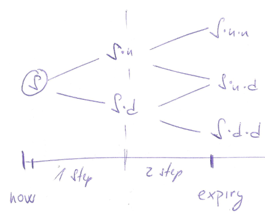
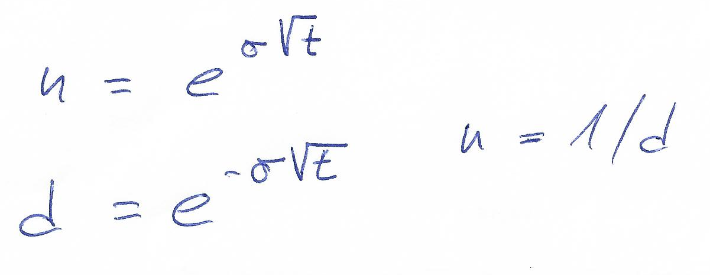

- title : Options pricing
- description : Pricing options in FSharp
- author : Jan Fajfr
- theme : night
- transition : default

***

## Options pricing

---

### What affects option price

- Call option (right to buy)
- Current stock price: 100
- Strike: 110
- Expires tomorrow
- What's the probability that the stock will reach 110 tomorrow?
- If 100%, then what is the faire price?

---

### What about the interest rate?

- Call option (right to buy), with strike 110
- Current underlying price: 100
- Expiries in 6 months
- The current interest rate is 10%
- How does the interest rate affect the option?

---

### Parameters

- All options parameters: strike, expiry, type, style
- Current underlying price
- Volatility of the underlying

---

### Pricing methods

- Black Scholes formula
- Tree based models - binomial or trinomial trees
- Monte Carlo methods
- Finite difference methods

---

### Binomial Pricing

- Construct a tree of possible stock prices
- The tree will go from now to the expiry
- We need a way to predict how the stock price moves

***

### Domain model for options and pricing

---

	type OptionKind =
	    | Call
	    | Put

	type OptionStyle =
	    | American
	    | European

	type OptionLeg = {
	        Direction : float
	        Strike : float
	        Expiry : DateTime
	        Kind : OptionKind
	        Style: OptionStyle
	        PurchaseDate: DateTime
	    }
	    member this.TimeToExpiry = this.Expiry - this.PurchaseDate
---
***

### About stock prices

---

### How do the stocks move in real life

- Stock price follows a long term direction
- Stock oscillates randomly in the short term
- This can be described using Wiener process

---

### Stock's behavior in binomial tree

- Still a stochastic model but much simpler
- Assume that any time the stock may go up or down
- Split the time between now and the expiry into discrete steps
- In each discrete step we will go up or down

---

### Stock prices tree

- Assume constants **u** and **d**
- Stock in the next step will have either value **S\*u** or **S\*d**
- To simplify, we can say that **d = 1/u**

---

### Stock prices tree

---

### Real-world binomial tree

- Cox, Ross & Rubinstein pricing model
- We can use the Volatility to obtain **u** and **d**

---

### Option price from stock price

- We know how to model the stock, but what about the option?
- At the expiry the price of the option is simple
- Before the expiry however it's not that clear

	match option.Kind with
		| Call -> max 0.0 (stockPrice - option.Strike)
		| Put -> max 0.0 (option.Strike - stockPrice)

---

### Introducing options tree

- We could maintain two trees
- We can calculate the leafs of the options tree

---

### Missing piece

---

### Modelling the tree

		type BinomialNode = {
		    Stock: double
		    Option: double
		    UpParent: BinomialNode option
		    DownParent: BinomialNode option
		}

---

### Summary so far
- We know how to model the tree of possible stock prices
- We know that we can calculate the leafs of options tree
- We still don't know how to walk the options tree

---
***

### Delta Hedging

- Portfolio immune to stock moves
- Long shares of stock = buy stock
- Short delta number options = selling options
- Such Portfolio earns the interest rate

---

### Delta neutral portfolio

---

### Consequences

- Portfolio earns the neutral interest rate
- It has the keeps the same value

---

### Option price definition

- Finally an equation to determine option price **P**

---

### Merging the nodes

	let mergeNodes downNode upNode context =
	    let optionValue = (context.PUp * upNode.Option +
				context.PDown * downNode.Option)
				*(1.0/context.Rate)

	    let stockValue = upNode.Stock * context.Down
	    {
	        Stock = stockValue
	        Option = optionValue
	        UpParent = Some upNode
	        DownParent = Some downNode
	    }

---
***

### Implementation overview

- Build the end nodes of both trees
- Walk both trees backwards
- Calculate option price from previous steps

---

### Implementation overview

---

### Generating the leafs

- All possible prices of the stock at expiry
- Taking into account the depth

	let generateEndNodePrices (ref:float) (up:float) (periods:int) =
    let down = 1.0 / up
    let lowestStock = ref*(down**(float periods))
    let values = Seq.unfold (fun stock -> stock*up*up) lowestStock
		values |> Seq.take periods
---

### Determine the option price in end node

	let optionValue option ref =
        match option.Kind with
                | Call -> max 0.0 (ref - option.Strike)
                | Put -> max 0.0 (option.Strike - ref)

---

### Single step in derivative tree

	let step pricing optionVal (prices:BinomialNode []) =
		prices
      |> Array.pairwise
      |> Array.map (fun (downNode,upNode) ->
				mergeNodes downNode upNode pricing
			)

---
### Reducing the tree to current node
- We will call this function recursively
- Reducing the array until it's only 1 element

	let prices = generateLeafs ctx

	let rec reducePrices prices =
		match prices with
			| [|node|] -> node.Option, node.UpParent.Value.Option
			| prs -> reducePrices (reductionStep prs)

---

### American options pricing

- For American options check for premature exercise
- If we exercise we can just calculate the payoff

	let option' =
	  match context.Option.Style with
      | American ->
          let prematureExValue = optionVal stockValue
          max derValue prematureExValue
      | European -> derValue

---

***

### Intuition for Monte Carlo

---

### Black & Scholes in F\#

- No presentation about Options Pricing without BS
- It is just a mathematical formula written in F\#

---

		let d1 =
        ( log(stock.CurrentPrice / option.Strike) +
            (stock.Rate + 0.5 * pown stock.Volatility 2) * option.TimeToExpiry ) /
        ( stock.Volatility * sqrt option.TimeToExpiry )
    let d2 = d1 - stock.Volatility * sqrt option.TimeToExpiry
    let N1 = normal.CumulativeDistribution d1
    let N2 = normal.CumulativeDistribution d2

    let discountedStrike = option.Strike * exp (-stock.Rate * option.TimeToExpiry)
    let call = stock.CurrentPrice * N1 - discountedStrike * N2

		match option.Kind with
        | Call -> call, N1
        | Put -> call + discountedStrike - stock.CurrentPrice, N1 - 1.0

### Summary

- Immutability is useful
- Performance might be an issue
